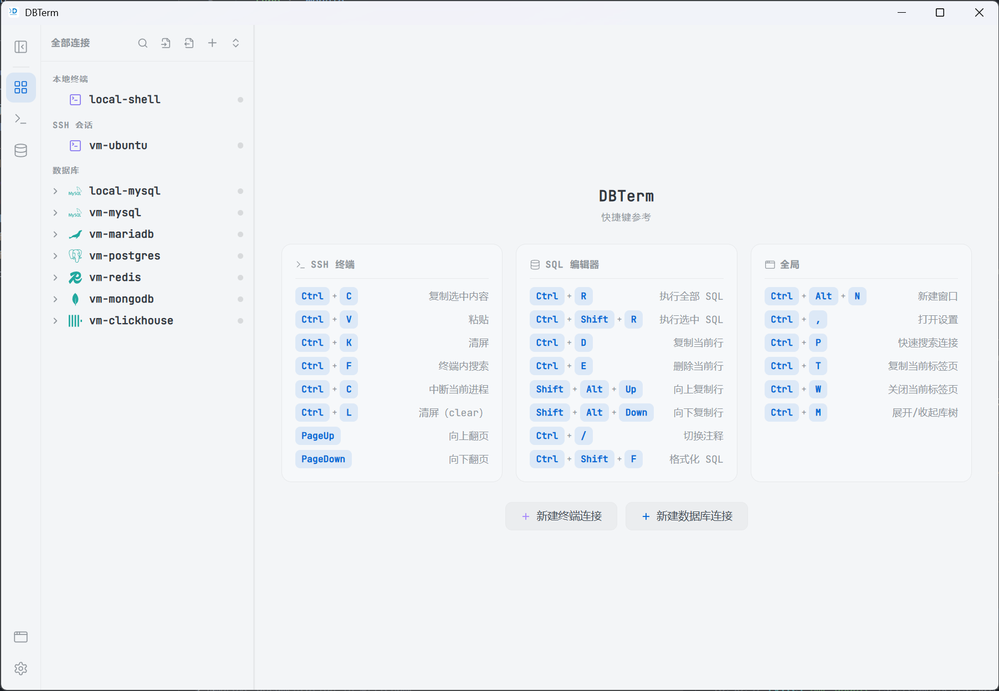
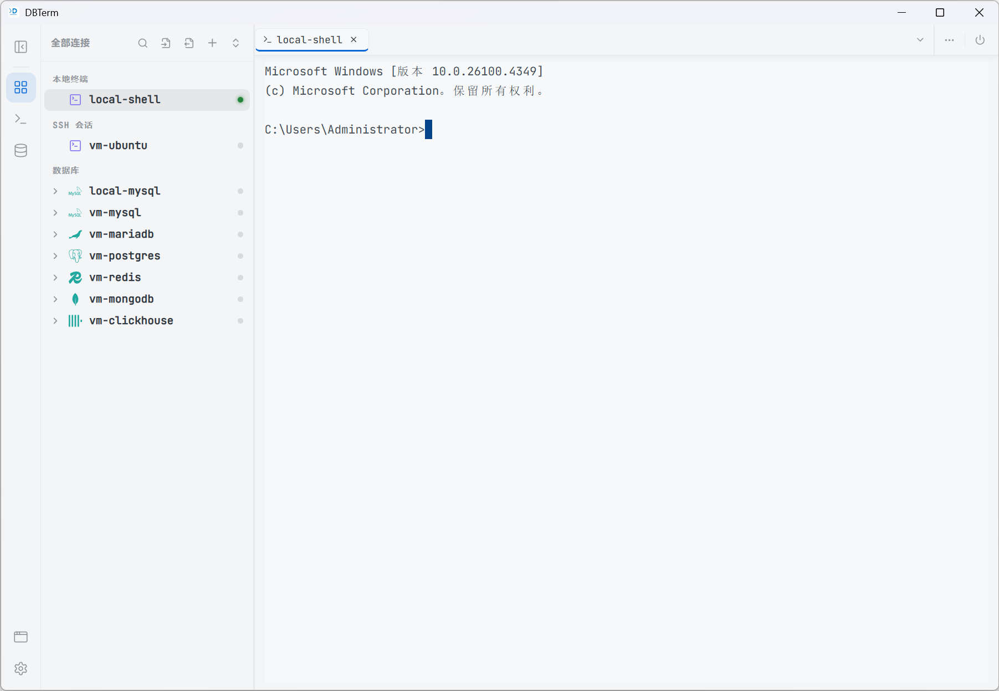
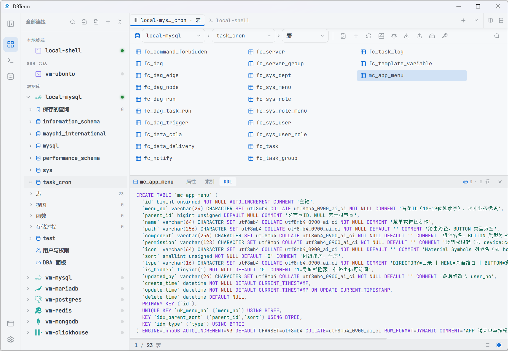
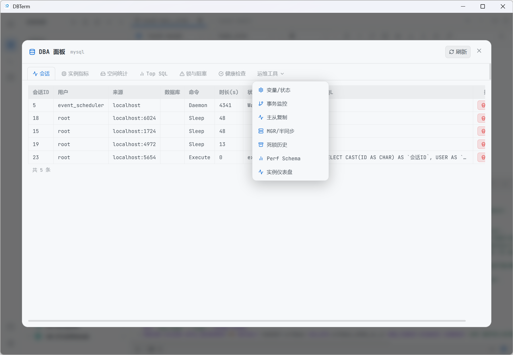
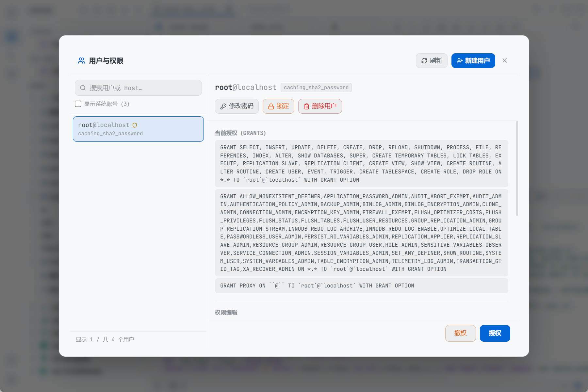

# DBTerm

DBTerm 是一款面向开发者、DBA 和运维团队的轻量级桌面数据库工作台。它把数据库客户端、SQL 编辑器、对象浏览器、DBA 运维工具、SSH 终端、本地终端和 SFTP 文件管理整合到一个应用里，适合日常查询、结构维护、问题排查、权限管理和多环境连接管理。

DBTerm 基于 Tauri v2 + React + TypeScript + Rust 构建。前端负责高效交互，Rust 后端负责数据库连接、SSH、PTY、驱动桥接和本地安全能力，在保持桌面体验的同时尽量降低安装包体积和运行负担。

## 界面预览

### 统一工作台

左侧统一管理本地终端、SSH 会话和多种数据库连接，工作区支持多标签打开终端、对象浏览、表数据和 SQL 编辑页面。



### 本地终端与 SSH

内置终端能力，支持本地 Shell、远程 SSH 会话、命令执行、快捷键操作和连接状态管理。



### 数据库对象浏览

按连接类型浏览库、Schema、表、视图、函数、存储过程、用户与权限等对象，并提供 DDL、属性、索引、数据预览等常用入口。



### DBA 运维面板

内置会话、实例指标、空间统计、Top SQL、锁与阻塞、健康检查、变量状态、事务监控、主从复制等运维工具，减少在脚本和多个客户端之间来回切换。



### 用户与权限管理

提供可视化用户列表、授权查看、密码修改、锁定用户、删除用户和授权撤销等操作入口，适合日常权限巡检和账号维护。



## 核心特点

- 一站式数据库工作台：数据库连接、对象浏览、SQL 编辑、终端、DBA 工具和文件能力集中在同一个桌面应用中。
- 多数据库统一入口：支持 MySQL、MariaDB、TiDB、OceanBase、PostgreSQL、KingBase、openGauss、SQLite、Redis、MongoDB、ClickHouse、DuckDB、SQL Server、Oracle 等连接类型。
- 面向真实运维场景：提供进程列表、锁分析、慢查询、实例指标、健康检查、空间统计、主从复制、事务监控、备份恢复、数据字典、ER 图、结构对比等工具。
- SQL 开发效率优先：支持多标签、保存查询、查询历史、批量执行、执行取消、格式化、结果表格、DDL 查看、表结构编辑、变量占位执行等能力。
- 方言感知：对象操作、DDL 生成、表结构维护和部分工具会根据数据库类型处理语法差异，避免把某一种数据库语法硬套到其他数据库上。
- 终端和数据库联动：本地终端、SSH 会话、数据库连接和 DBA 工具可以在同一个工作台里并行使用，适合排查线上问题和处理多环境任务。
- 安全边界清晰：连接密码独立存储，不写入连接配置文件；支持环境标签、只读模式和连接测试，降低误连、误查、误操作风险。
- 轻量安装包：基于 Tauri 复用系统 WebView，不内置完整浏览器内核；Oracle、SQL Server、DuckDB、达梦等外部驱动按需安装或手动指定。
- 中文优先体验：连接、对象、错误提示、运维工具和常见操作围绕中文用户习惯设计。

## 主要能力

### 连接管理

- 支持连接分组、搜索、颜色标记、环境标签和只读模式。
- 支持数据库连接、SSH 连接、本地终端统一管理。
- 支持连接测试、驱动探测、连接导入导出和快捷创建。

### SQL 与对象操作

- SQL 编辑、格式化、执行全部或选中 SQL、执行取消、结果复制和导出。
- 保存查询、查询历史、SQL 变量填写、批量执行和多标签工作流。
- 表、视图、字段、索引、函数、存储过程等对象浏览。
- 创建表、修改表结构、查看 DDL、预览表数据、字段和索引维护。

### DBA 与高级工具

- 会话管理、进程列表、锁与阻塞、慢查询、执行计划、实例指标。
- 数据导入导出、导出任务中心、结构对比、数据字典、ER 关系图。
- MySQL/MariaDB/TiDB/OceanBase、PostgreSQL/openGauss/KingBase、ClickHouse、SQL Server、Oracle、SQLite、DuckDB 等数据库的专属工具面板。
- Redis key 浏览、值编辑、慢日志、服务状态、发布订阅和批量管理。
- MongoDB 集合浏览、聚合、索引、GridFS、用户权限、状态巡检和风险检查。

### SSH 与终端

- 本地终端和远程 SSH 终端。
- SSH 密钥管理、SSH 配置导入、Known Hosts 管理。
- SFTP 文件管理、隧道、命令片段、命令历史和性能辅助面板。

## 支持的连接类型

| 类型 | 连接方式 | 说明 |
| --- | --- | --- |
| 本地终端 | PTY | 本机 Shell 会话 |
| SSH | Rust SSH + PTY | 远程终端、SFTP、隧道、密钥管理 |
| MySQL / MariaDB / TiDB / OceanBase | 原生协议 | 兼容 MySQL 协议族 |
| PostgreSQL / KingBase / openGauss | 原生协议 | 兼容 PostgreSQL 协议族 |
| SQLite | 本地文件 | 本地数据库文件浏览与管理 |
| Redis | 原生协议 | key 浏览、值编辑、慢日志、服务状态 |
| MongoDB | 官方 Rust 驱动 | 集合、索引、聚合、GridFS、巡检 |
| ClickHouse | TCP / HTTP | 查询、对象浏览和运维辅助 |
| DuckDB | 动态库加载 | 本地分析型数据库能力 |
| SQL Server | TDS / ODBC | 查询、对象浏览和管理工具 |
| Oracle | Instant Client | 通过 OCI 动态加载 |
| 达梦 DM8 | ODBC | 需要官方客户端与 ODBC 驱动 |

## 适用场景

- 开发调试：写 SQL、查表结构、看 DDL、保存常用查询、对比结果。
- DBA 运维：看会话、查锁、做巡检、看慢 SQL、管理用户权限、分析实例状态。
- 后端排障：同屏使用数据库、SSH、终端和文件工具，快速定位线上问题。
- 数据处理：使用 SQLite、DuckDB、ClickHouse 等进行本地或分析型数据处理。
- 企业内部工具链：统一连接配置、驱动来源和安全边界，减少散落客户端和临时脚本。

## 技术栈

- 桌面框架：Tauri v2
- 前端：React 18、TypeScript、Vite、Zustand
- 编辑器：CodeMirror、sql-formatter
- 终端：xterm.js
- 后端：Rust、Tokio、Tauri IPC
- 数据库：sqlx、redis、mongodb、tiberius、ClickHouse、ODBC、OCI、动态库桥接
- 图形与导出：React Flow、html-to-image、xlsx

## 本地开发

### 环境要求

- Node.js 18 或更高版本
- npm
- Rust stable
- Tauri v2 所需系统依赖
- 如需连接 Oracle、SQL Server、达梦、DuckDB，请按应用内驱动管理提示安装对应驱动

### 安装依赖

```bash
npm install
```

### 前端开发

```bash
npm run dev
```

### 桌面端开发

```bash
npm run dev:desktop
```

### 类型检查与测试

```bash
npm run typecheck
npm test
cd src-tauri && cargo check
```

### 生产构建

```bash
npm run build
npm run dist
```

## 项目结构

```text
src/                    React 前端应用
src-tauri/              Tauri / Rust 后端
docs/images/            README 截图资源
build.js                跨平台打包脚本
```

## 安全特性

- 连接密码独立存储，不写入连接配置文件。
- 支持生产、预发、测试等环境标记，降低误操作风险。
- 支持只读连接模式，适合生产库查询和巡检场景。
- 外部驱动按需安装，便于在企业环境中统一管控来源和版本。
- 连接测试、驱动检测和错误提示集中在应用内完成，便于定位环境问题。

## 授权

本项目为私有软件项目，未公开授予开源许可证。未经授权，不得复制、分发、转售、托管、二次发布或用于商业交付。

详细条款见 [LICENSE](LICENSE)，项目授权与真实性声明见 [CERTIFICATE.md](CERTIFICATE.md)。
